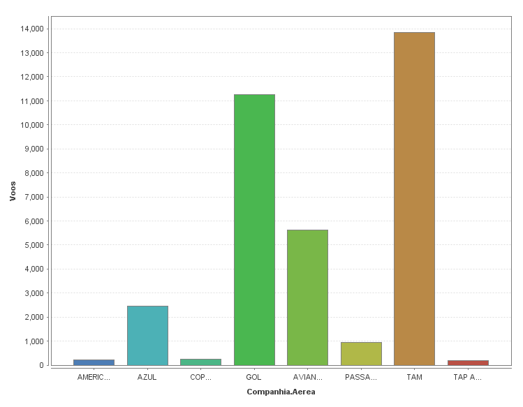
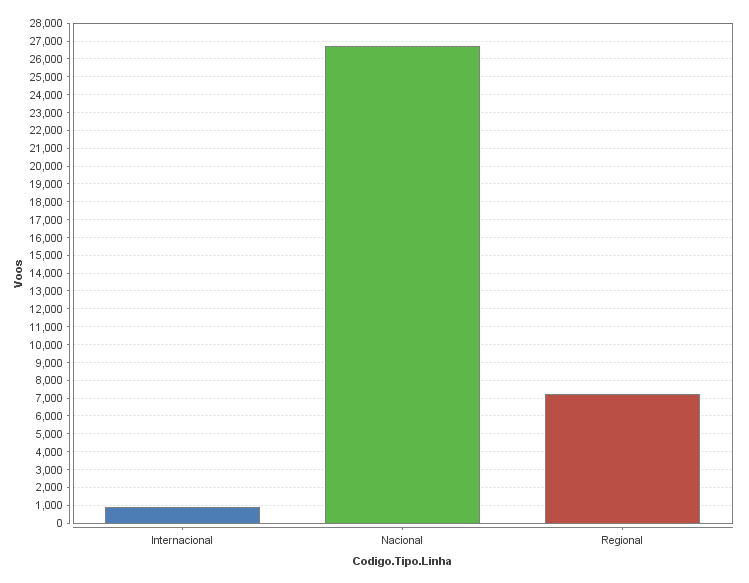
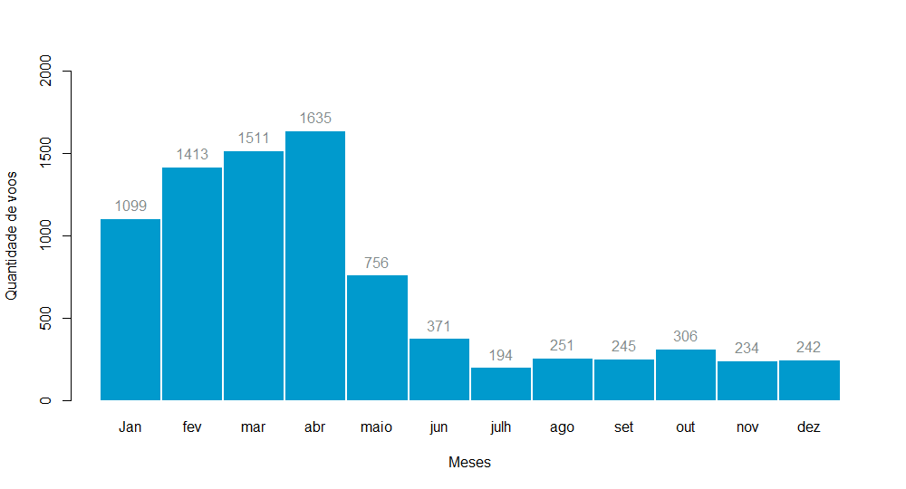
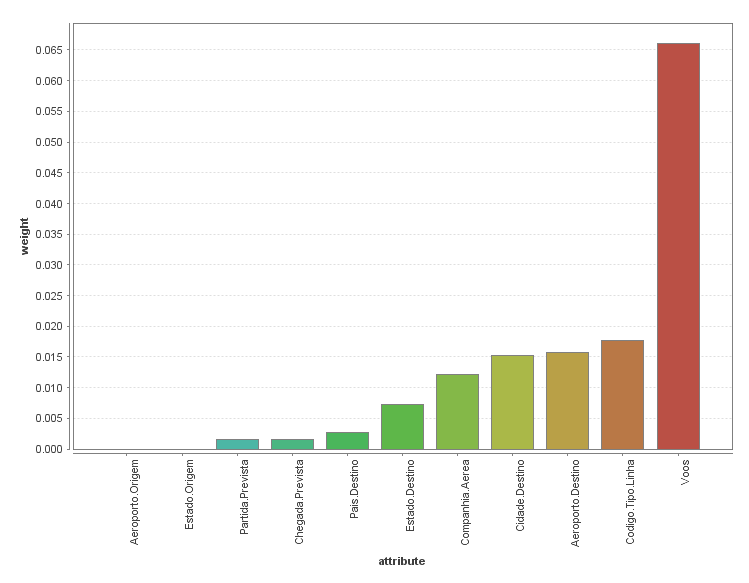

# Análise de Voos Brasileiros (Foco em Brasilia)
Análise de voos da cidade de Brasília. Projeto desenvolvido na disciplina de Business Intelligence em conjunto com Guilherme da Fonseca.

Obs: A maior partes das informações foram adiquiridas utilizando a plataforma de Data Sciente [Rapid Miner](https://rapidminer.com) 
<h1>Visão Geral</h1>
Dataset: https://www.kaggle.com/ramirobentes/flights-in-brazil
<h2>Voos<h2>
<ul>
    <li>AL - 214</li>
    <li>AZU - 2428</li>
    <li>AZU - 4135</li>
    <li>TAM - 3730</li>
</ul>

<h2>Tipo de Linha<h2>
<ul>
    <li>Nacional</li>
    <li>Internacional</li>
    <li>Regional</li>
</ul>

<h2>Companhias Aéreas</h2>

<h2>Tipos de voo</h2>

<h2>Quantidade de voos por mês</h2>
<h3>Codigo em R para plotagem simples.</h3>
#Legendas para as barras

meses = c("Jan","fev","mar","abr","maio","jun","julh","ago","set","out","nov","dez")

#Dados de voos de cada mês, em ordem

qtdvoos= c(1099,1413, 1511, 1635, 756, 371, 194, 251, 245, 306, 234, 242)

#remove a borda das barras

par(lty = 0)

#Cria as barras passando os dados e configurando o básico

 mp <- barplot(qtdvoos, names.arg = meses, xlab = "Meses", 
    ylab = "Quantidade de voos", ylim = c(0,2000), col="deepskyblue3", space =0.03)
    
#Adiciona a legenda nas barras com os valores

text(mp, qtdvoos, labels = qtdvoos, pos = 3, col='azure4')

<h2>Ganho de informação dos atributos</h2>

